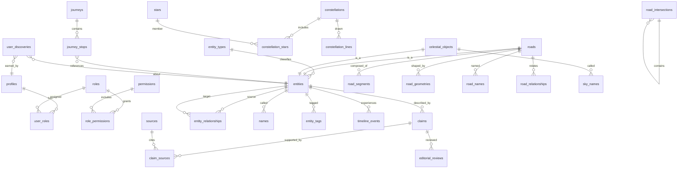
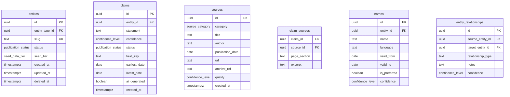
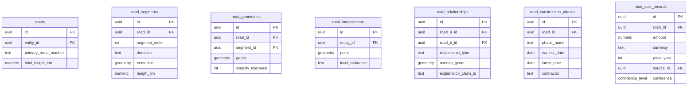
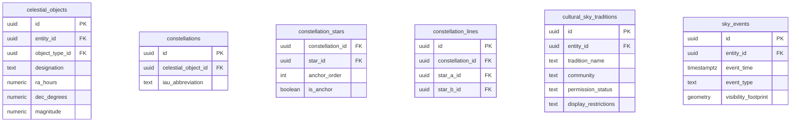
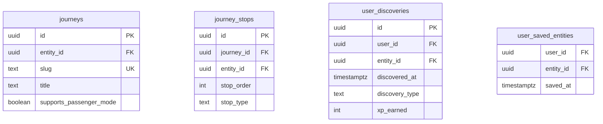

# Database ERD — Living Atlas SA

Initial entity-relationship diagram for the shared core and domain modules. Full DDL arrives in Milestone 1 migrations.

## High-level modules



## Shared core (detail)



## Road domain (detail)



## Sky domain (detail)



## Gamification (detail)



## Relationship types (road)

```
intersects, runs_parallel_to, merges_with, splits_from, continues_as,
formerly_continued_as, shares_alignment_with, feeds_into, provides_relief_for,
replaced, was_replaced_by, crosses_over, passes_under, follows_old_boundary,
follows_watercourse, follows_ridge, connects_place, divides_place
```

## Indexes (planned)

- GIST on all geometry columns
- Trigram GIN on `names.name`, `roads.primary_route_number`
- Full-text on `claims.statement`, entity search vectors
- Composite: `(entity_id, status)` on claims
- `(user_id, entity_id)` unique on `user_saved_entities`

## Migration file plan

| File | Contents |
|------|----------|
| `20250623000000_extensions_and_enums.sql` | ✅ PostGIS, enums |
| `20250624000000_shared_core.sql` | M1: entities, claims, sources, names |
| `20250624000001_auth_roles_rls.sql` | M1: profiles, roles, RLS |
| `20250625000000_road_domain.sql` | M2: roads, segments, geometries |
| `20250626000000_sky_domain.sql` | M4: celestial objects, constellations |
| `20250627000000_gamification.sql` | M6: journeys, discoveries |
| `20250628000000_business_placeholders.sql` | M1: orgs, plans, entitlements |
